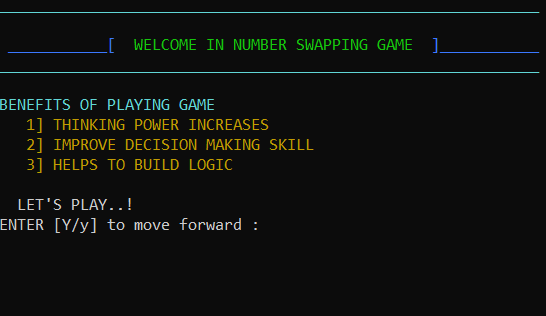
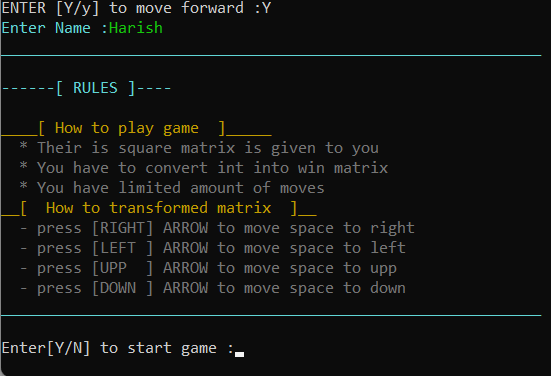
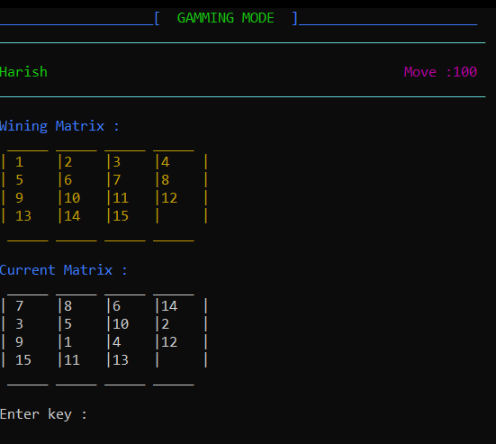

# Number Swapping Game

This is a console-based number swapping game implemented in C++. The objective of the game is to swap numbers in one matrix to match another matrix. If the matrices are the same after swapping, the player wins.

## How to Play

1. Launch the game by running the executable file.
2. The initial matrix will be displayed on the console, representing the starting state.
3. The player needs to use arrow key to move the number at place empty space.
4. The game will update the matrix with the swapped numbers.
5. Compare the updated matrix with the target matrix.
6. If the matrices match, the player wins; otherwise, continue swapping until the correct arrangement is achieved.
7. The game ends when the player successfully matches the matrices or chooses to quit.

## Screenshots

Here are some screenshots that demonstrate the gameplay and output of the number swapping game:

This is welcome page when first time game launch 

Enter your name and read all the rules 

This is main page of the game you have 100 move to create winning matrix 

<!-- Add more screenshots and captions if needed -->

## Getting Started

To run the game locally on your machine, follow these steps:

1. Clone the repository or download the source code files.
2. Ensure you have a C++ compiler installed on your system.
3. Compile the source code files game.cpp
4. Run the game.exe file

## Game Features

- Console-based gameplay
- Randomized initial matrix and target matrix for each game session
- Input validation to prevent invalid moves
- Option to quit the game at any time

## Dependencies

This game does not have any external dependencies. It is implemented using only the standard C++ library.

## Contributing

Contributions are welcome! If you would like to contribute to this project, please follow these steps:

1. Fork the repository.
2. Create a new branch for your feature or bug fix.
3. Make your changes and test thoroughly.
4. Submit a pull request, explaining the changes you've made.

## License

